# TeamBoard

TeamBoard is a Django REST API for user registration, JWT login, knowledge base querying, and an admin usage summary endpoint.

## Prerequisites

- Python 3.12+ recommended
- Docker Desktop for the provided PostgreSQL container
- A virtual environment

## Database Setup

The project uses PostgreSQL.

### Option 1: Start PostgreSQL with Docker

```bash
docker compose up -d postgres
```

This starts a PostgreSQL container using the values in `docker-compose.yml`:

- Database: `teamboard_db`
- User: `teamboard_user`
- Port: `5433`

### Option 2: Use an existing PostgreSQL server

Create a `.env` file in the project root with values like these:

```env
DJANGO_SECRET_KEY=your-secret-key
DJANGO_DEBUG=True
DJANGO_ALLOWED_HOSTS=localhost,127.0.0.1,testserver

DB_NAME=teamboard_db
DB_USER=teamboard_user
DB_PASSWORD=teamboard_pass
DB_HOST=127.0.0.1
DB_PORT=5433
```

## Install Dependencies

```bash
python -m venv .venv
.venv\Scripts\Activate.ps1
pip install -r requirements.txt
```

## Apply Migrations

Create and apply database migrations with:

```bash
python manage.py makemigrations
python manage.py migrate
```

If the models have not changed, you only need:

```bash
python manage.py migrate
```

## Seed KB Entries

Populate the knowledge base with the baseline entries:

```bash
python manage.py seed_kb
```

The seed command is safe to run multiple times because it uses `get_or_create` for each question.

## Run the Server

Start the development server with:

```bash
python manage.py runserver
```

The API will be available at:

```text
http://127.0.0.1:8000/api/
```

## Postman Scenarios

The repository includes a Postman collection that covers these 11 scenarios:

1. Register a new company
2. Register a company with duplicate name
3. Login with valid details
4. Wrong login details
5. Query KB - No Token
6. Query KB - Valid Token, Keyword with results
7. Query KB - Valid Token, no Matching results
8. Query KB - Missing search field
9. Usage summary client token
10. Usage summary admin token
11. Verify query log created in PG Admin

## Screenshots From The Postman
This is how different api endpoints respond to given json input. 

### 1. Register a new company

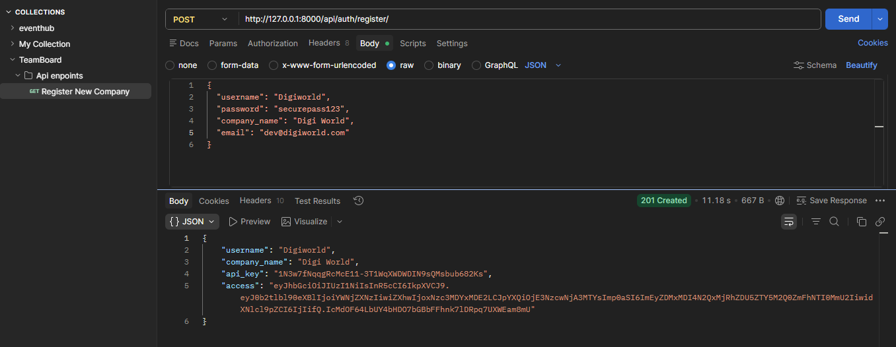

### 2. Register a company with duplicate name

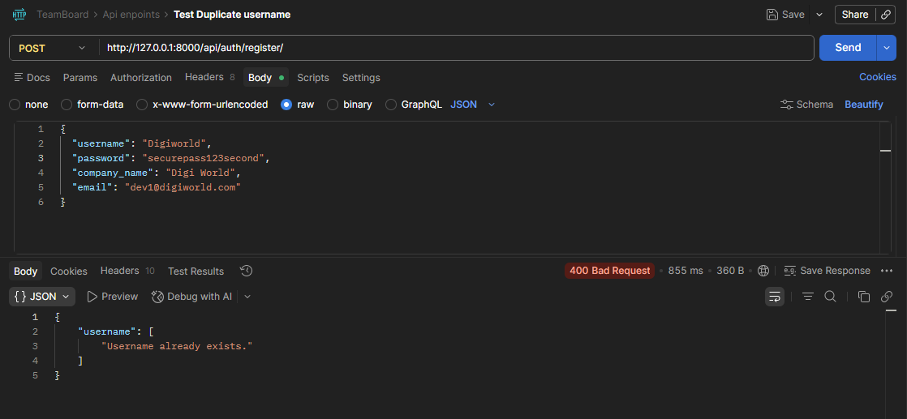

### 3. Login with valid details

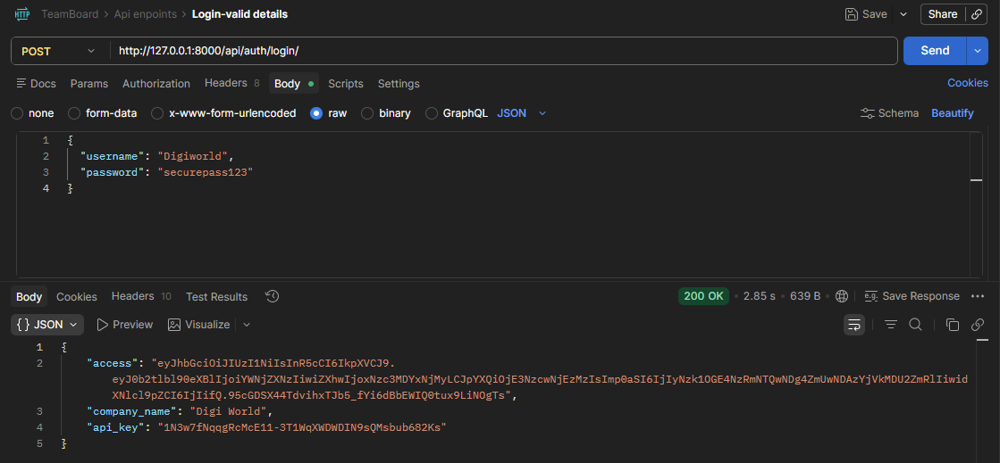

### 4. Wrong login details

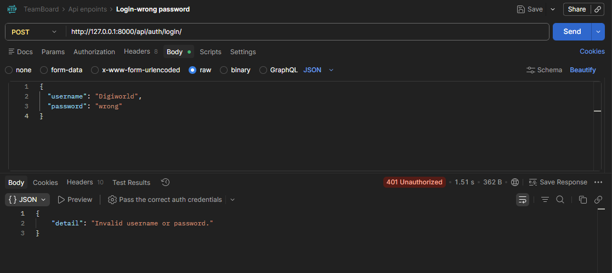

### 5. Query KB - No Token

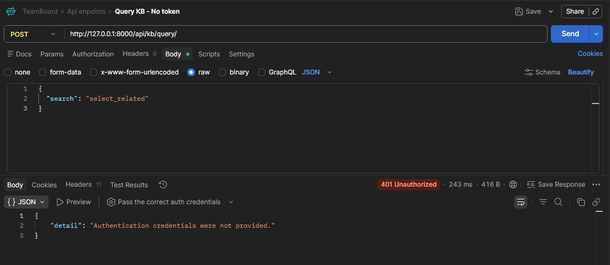

### 6. Query KB - Valid Token, Keyword with results

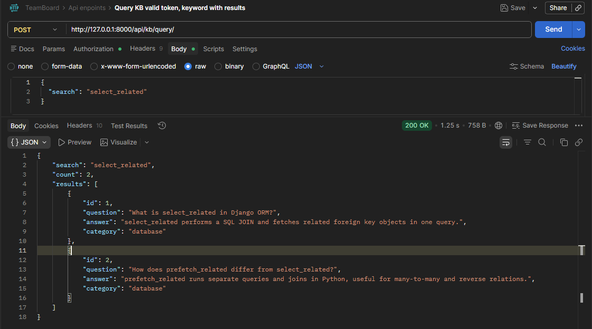

### 7. Query KB - Valid Token, no Matching results

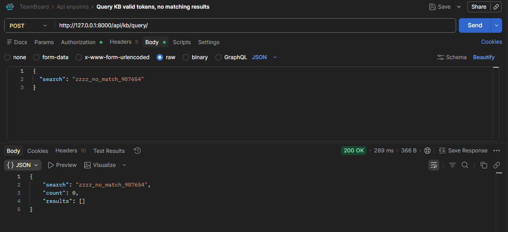

### 8. Query KB - Missing search field

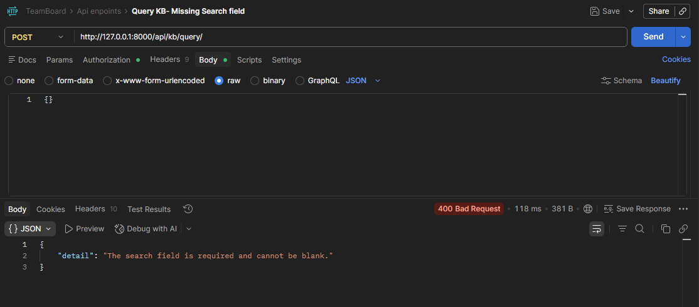

### 9. Usage summary client token

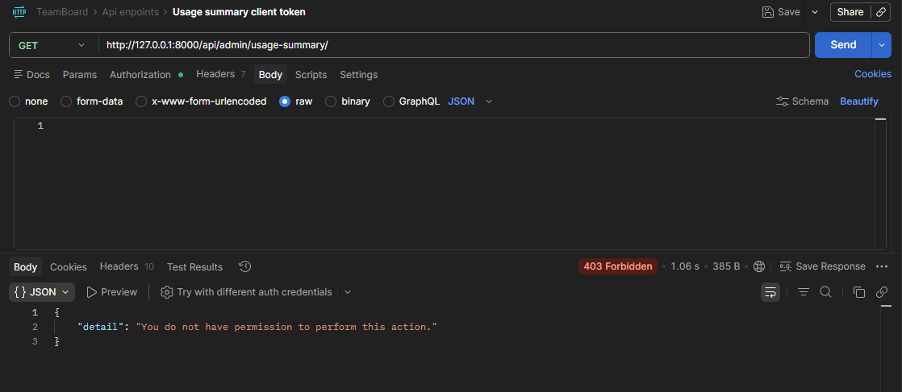

### 10. Usage summary admin token

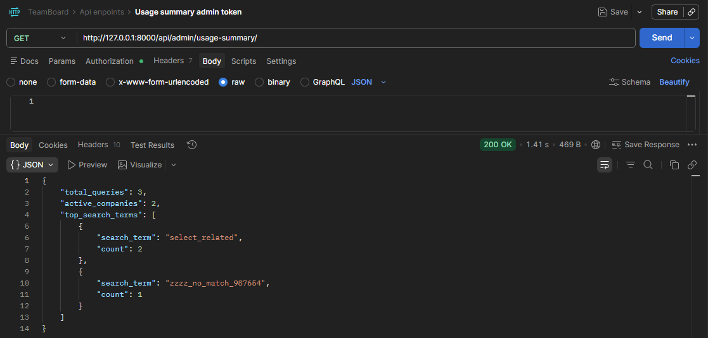

### 11. Verify query log created in PG Admin

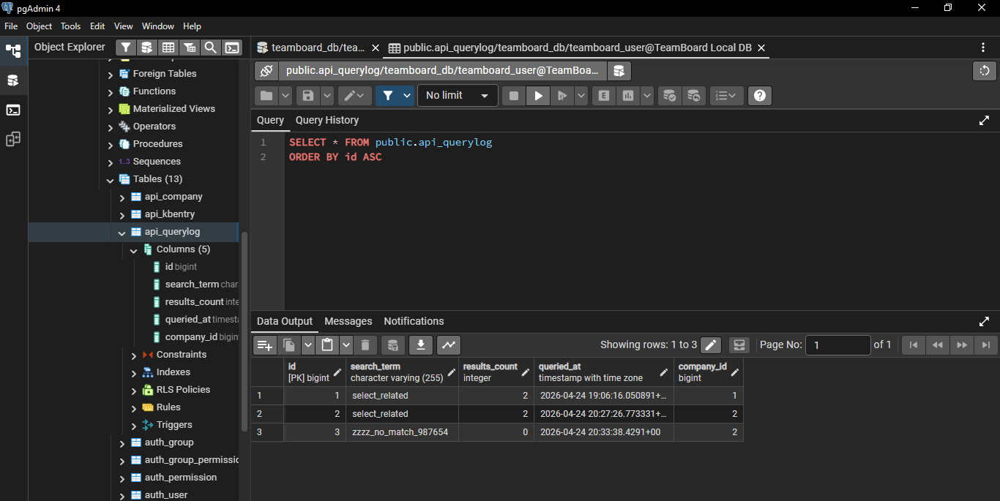
